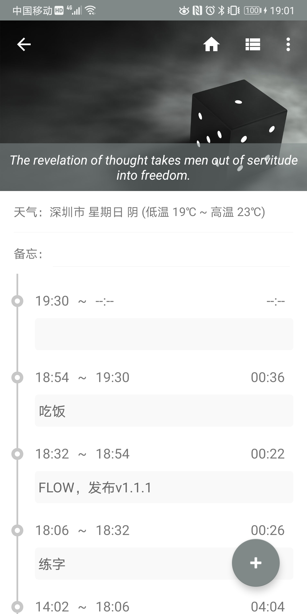
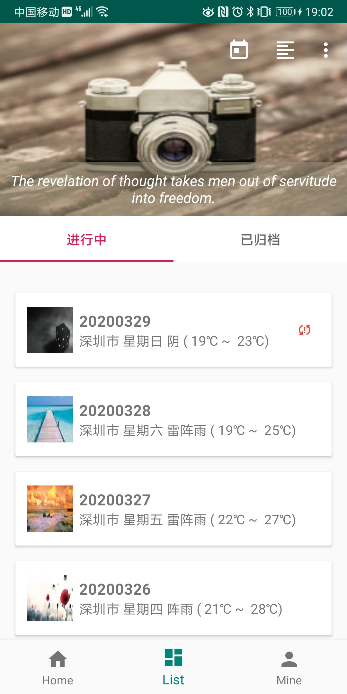
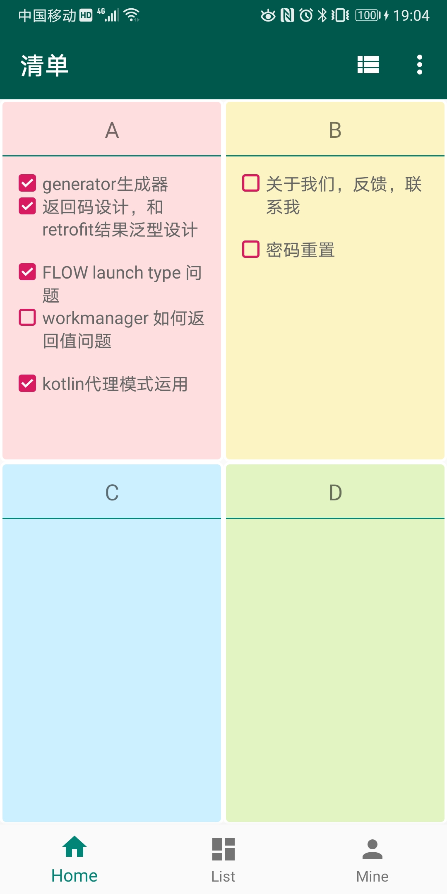
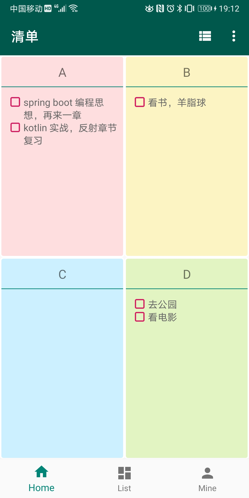
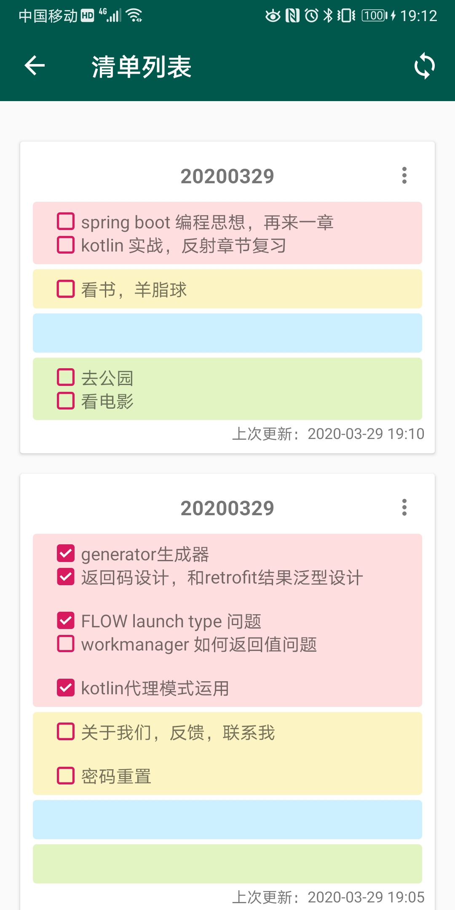
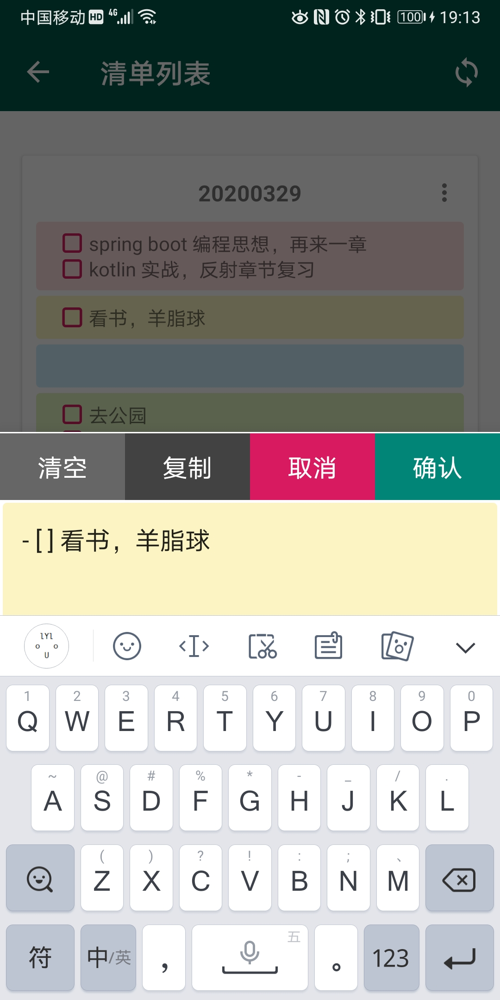
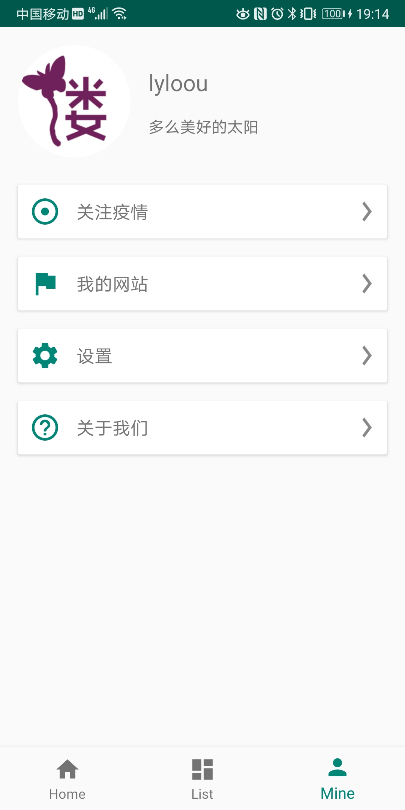

# 夫路

 

 

取名“夫路”，是指"一个人走过的路"的意思，
logo 里也是想表达这个意思。

主要包含两个模块：一个是清单，另一个时间流；

- 清单模块的想法来自，【高效 Todo】这个 app

- 时间流模块，想法来自《奇特的一生》一书，将每天做过的事情，完成的时间记录下来。

感兴趣可以下载来试试哦，目前已经添加了同步功能，用户这块还要在优化一下。

[https://github.com/lyloou/flow/releases](https://github.com/lyloou/flow/releases)

## 时间流

 

 

## 清单

 

 

## 清单列表

 

## 个人页面

 

 
